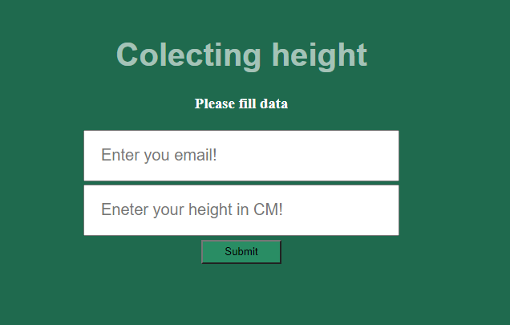

WEBapp for submitting user email and height data. 
After submitting required information user receives email with summary of submitted data, record count in database and average height reading.

Individual settings need to bee configured: 
1)outgoing SMTP server 
2)email and password for sending out emails  
3)connection to PostgreSQL database 

https://maris-height-data.herokuapp.com/

